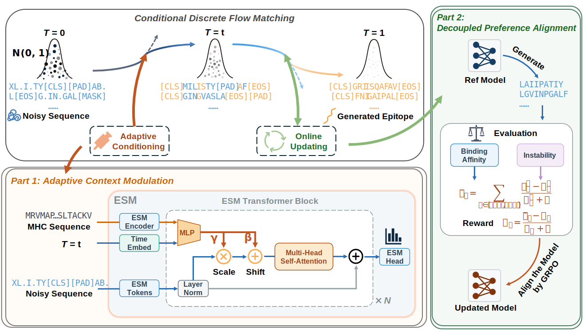

# EpiFlow

Official implementation of **"EpiFlow: Preference-Aligned Discrete Flow Matching for Target-Conditioned Epitope Design"**.

## Overview

EpiFlow addresses the challenge of designing peptides that bind specifically to given MHC alleles. The framework consists of two main stages:

1. **Discrete Flow Matching Pre-training**: An ESM2-based denoising model is trained to reverse a discrete diffusion process, learning to generate valid peptide sequences conditioned on MHC embeddings.
2. **Preference Alignment with GRPO**: The pre-trained model is fine-tuned using reinforcement learning with reward functions that evaluate **binding affinity** (via an ESM2-based BA predictor) and **peptide instability** (via biophysical analysis).



## Installation

### Prerequisites

- Python 3.10
- CUDA 12.6 (for GPU support)

### Key Dependencies

The core dependencies for running EpiFlow are listed below. For the full environment specification, see [`environments.yaml`](environments.yaml).

```bash
# Core deep learning
torch==2.9.0+cu126
torchvision==0.24.0+cu126

# ESM2 protein language model
fair-esm==2.0.0

# Discrete flow matching framework
flow-matching==1.0.10

# Scientific computing
numpy==1.26.4
pandas==1.5.3
scipy==1.14.1
scikit-learn==1.7.2
biopython==1.79
```

### Setup from YAML

```bash
conda env create -f environments.yaml
conda activate epiflow
```

## Data Preparation

The `data/` directory contains the necessary files:

| File | Description |
|------|-------------|
| `full_seq_dataset.csv` | Training dataset with peptide sequences and MHC alleles |
| `allele_100.txt` | List of 100 MHC alleles for generation/evaluation |
| `allele_to_sequence.json` | Mapping from allele names to MHC sequences |
| `mhc_embeddings_esm2_t6_8M_UR50D.pt` | Pre-computed ESM2 embeddings for MHC alleles |

If you need to generate MHC embeddings for new alleles:

```python
import torch
import esm

# Load ESM2 model
model, alphabet = esm.pretrained.esm2_t6_8M_UR50D()
batch_converter = alphabet.get_batch_converter()
```

## Usage

### 1. Pre-training with Discrete Flow Matching
Train the base ESM2-based discrete flow matching model:
```bash
python train_flow_matching.py \
    --esm_model esm2_8m \
    --input_esm_dim 320 \
    --num_classes 33 \
    --batch_size 128 \
    --lr 1e-4 \
    --guidance_scale 1.0 \
    --epochs 1000 \
    --dataset_path data/full_seq_dataset.csv \
    --mhc_embedding data/mhc_embeddings_esm2_t6_8M_UR50D.pt \
    --model_dir ./checkpoints \
    --log_dir ./logs \
    --device cuda
```

**Key Arguments:**
- `--esm_model`: ESM2 variant (`esm2_8m` or `esm2_150m`)
- `--guidance_scale`: Classifier-free guidance scale for conditional generation
- `--adaptive`: Enable adaptive FiLM-style conditioning layers
- `--num_classes`: Vocabulary size (33 for ESM2 tokens)

### 2. Preference Alignment with GRPO

Fine-tune the pre-trained model using GRPO with binding affinity and instability rewards:

```bash
python train_grpo.py \
    --esm_model esm2_8m \
    --input_esm_dim 320 \
    --num_classes 33 \
    --pretrained_path ./checkpoints/best_model_1.pt \
    --n_cond_per_step 4 \
    --num_samples_per_cond 32 \
    --kl_coef 0.01 \
    --alpha 0.7 \
    --w_instability 1.0 \
    --w_binding 1.0 \
    --guidance_scale 1.0 \
    --num_epochs 1000 \
    --save_dir ./checkpoints \
    --log_dir ./logs \
    --device cuda
```

**Key Arguments:**
- `--pretrained_path`: Path to the pre-trained flow matching checkpoint
- `--kl_coef`: KL divergence coefficient for regularization
- `--n_cond_per_step`: Number of MHC conditions per training step
- `--num_samples_per_cond`: Number of peptide samples per condition

### 3. Sampling Peptides

Generate peptides for a specific MHC allele using the trained model:

```python
from sample_flow_matching import sample_flow_matching_discrete, decode_samples

samples = sample_flow_matching_discrete(
    num_classes=33,
    esm_model='esm2_8m',
    input_esm_dim=320,
    n_samples=100,
    step_size=0.1,
    model_path='checkpoints/best_model_1.pt',
    conditional=True,
    mhc_allele='HLA-A*02:01',
    guidance_scale=1.0,
    adaptive_guidance=False,
    mhc_embedding_path='data/mhc_embeddings_esm2_t6_8M_UR50D.pt',
    device='cuda'
)

sequences = decode_samples(samples)
print(sequences)
```

### 4. Batch Generation for Multiple Alleles

Generate peptides for all alleles listed in `data/allele_100.txt`:

```bash
python generate_allele_sequences.py
```

Or customize the parameters:

```python
from generate_allele_sequences import generate_sequences_for_all_alleles

df = generate_sequences_for_all_alleles(
    allele_file='data/allele_100.txt',
    output_file='results/generated_peptides.csv',
    n_samples_per_allele=100,
    model_path='checkpoints/best_model_2.pt',
    guidance_scale=1.0,
    step_size=0.1,
    device='cuda'
)
```

## Checkpoints

| Checkpoint | Description |
|------------|-------------|
| `BA_predictor_esm2_t6_8M_UR50D.pt` | Pre-trained binding affinity predictor ([Google Drive](https://drive.google.com/file/d/1Yz0zKPP8boi4cwoKgNlBY7RTfvMGs1Pt/view?usp=sharing)) |
| `best_model_1.pth` | Pre-trained discrete flow matching model |
| `best_model_2.pth` | Fine-tuned model with GRPO |
| `esm2_t6_8M_UR50D.pt` | ESM2 base model weights |

